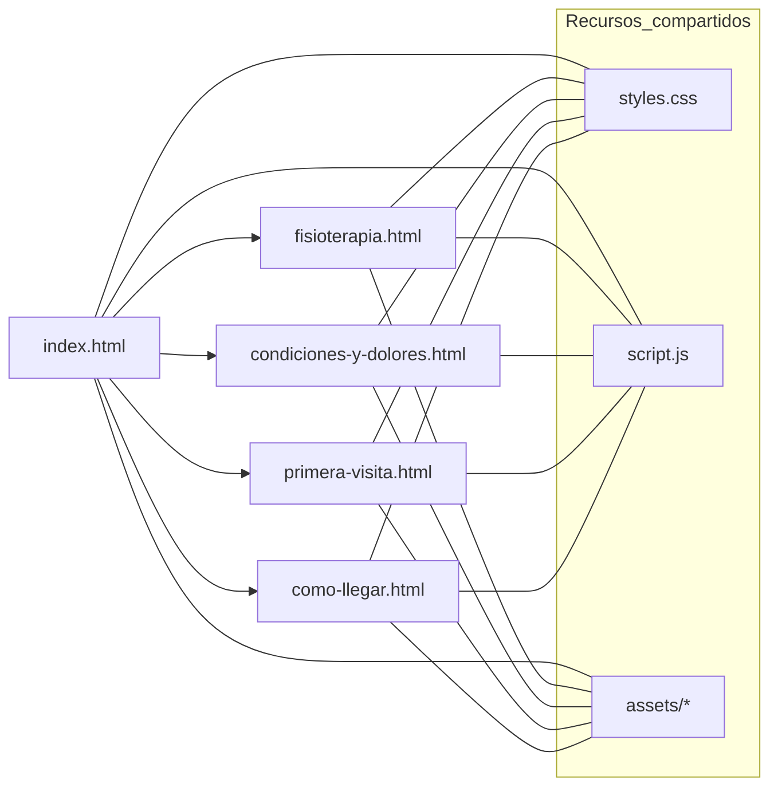

# Centro de Terapia Física Valdiviezo — Sitio Web Oficial

**Descripción**

Sitio web oficial del Centro de Terapia Física Valdiviezo, ubicado en Piura, Perú. El objetivo principal del sitio es mejorar el posicionamiento SEO local, generar confianza en pacientes potenciales y acelerar la captación de consultas mediante un flujo de contacto directo vía WhatsApp.

---

## Arquitectura del Proyecto

El proyecto está construido como un sitio Multi-Page (MPA) estático. Esta arquitectura prioriza la indexabilidad por motores de búsqueda y la simplicidad de despliegue:

- Archivos HTML independientes por página para mejorar señales semánticas y SEO.
- Estilos centralizados en `styles.css` y comportamiento en `script.js` (Vanilla JS).
- Recursos estáticos agrupados en `assets/` (imágenes en `.webp` para optimización).

### Motivación de la migración a MPA

Originalmente se trabajó con un enfoque similar a SPA; sin embargo, para garantizar mejor indexación (especialmente local SEO) y eliminar dependencias de enrutamiento por JS, se refactorizó a MPA.

### Diagrama de Arquitectura (Mermaid)



---

## Stack Tecnológico

- HTML5 semántico
- CSS3 con Variables (Custom Properties) para control de tema y colores
- Vanilla JavaScript (sin frameworks)
- Imágenes optimizadas en `.webp`
- Despliegue estático (Netlify, GitHub Pages, S3, etc.)

No existe backend ni base de datos; la captación de consultas se realiza mediante WhatsApp.

---

## Funcionalidades Clave

- Modo Oscuro/Claro persistente (usa `localStorage` para recordar la preferencia del usuario).
- Navegación responsive con menú hamburguesa; dropdowns en la sección `Servicios`.
- Submenú con comportamiento táctil-friendly (toggle) y scroll interno si el menú ocupa más altura que la pantalla.
- Modal global para agendar citas que valida campos mínimos y construye un mensaje para WhatsApp.
- Integración directa con `https://wa.me/<NUM>` para abrir conversaciones con el número configurado.
- Imágenes optimizadas y layout responsive para buen rendimiento y experiencia móvil.

---

## Estructura de Directorios

```
TerapiaFisica-Valdiviezo/
├── index.html
├── fisioterapia.html
├── condiciones-y-dolores.html
├── primera-visita.html
├── como-llegar.html
├── styles.css
├── script.js
└── assets/
    ├── images/
    │   ├── logo.webp
    │   └── (otros .webp)
    └── img/
        └── (imágenes de contenido)
```

---

## Guía Rápida de Desarrollo Local

1. Clona o descarga el repositorio.
2. Opcional: sirve los archivos con un servidor estático local:

```bash
# Usando Python 3
python -m http.server 8000

# Usando http-server (Node.js)
npx http-server . -p 8000
```

3. Abre `http://localhost:8000` en tu navegador.

### Configuración importante

- Edita `script.js` y actualiza `WHATSAPP_NUMBER` con el número oficial (formato internacional, ej. `51950xxxxxx`).
- Revisa textos en cada `*.html` para localización, horarios y dirección.

---

## Despliegue (Recomendado)

- Netlify: despliega desde un repositorio Git, o arrastra la carpeta al panel de Netlify Drag & Drop.
- GitHub Pages: configurar `gh-pages` o usar el repositorio `username.github.io`.
- Amazon S3 / CloudFront para hosting estático con CDN.

Recomendaciones:

- Activar compresión Brotli/Gzip en el servidor.
- Configurar `Cache-Control` para recursos estáticos (`assets/`).
- Usar HTTPS obligatorio para integraciones modernas.

---

## Consideraciones SEO y UX

- Asegúrate de tener metadatos únicos en cada página (`title`, `description`, `og:*`).
- Cada página tiene rutas propias (`/fisioterapia.html`, `/como-llegar.html`, etc.) para indexación por Google.
- Mantener tiempos de carga bajos (optimiza imágenes, reduce JS innecesario).

---

## Mantenimiento y Buenas Prácticas

- Centralizar variables de estilo en `:root` dentro de `styles.css`.
- Documentar cualquier cambio en `script.js` especialmente si se añade lógica para formularios o tracking.
- Si se requiere captura de leads más avanzada, valorar un webhook o servicio de formulario externo que almacene datos además de WhatsApp.

---

## Contacto y Soporte

Para cambios funcionales o soporte, contacta al propietario del sitio o al desarrollador responsable de la versión actual.

---

© Centro de Terapia Física Valdiviezo — Piura, Perú